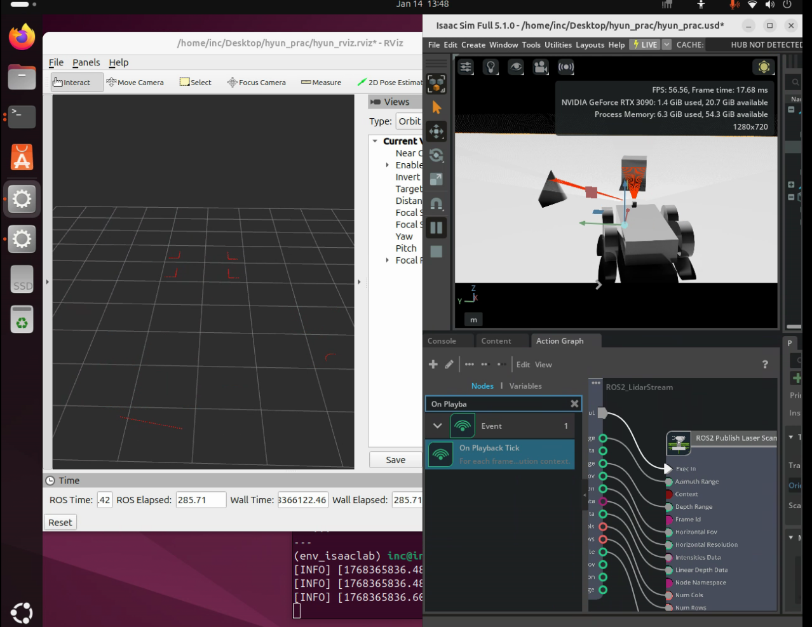
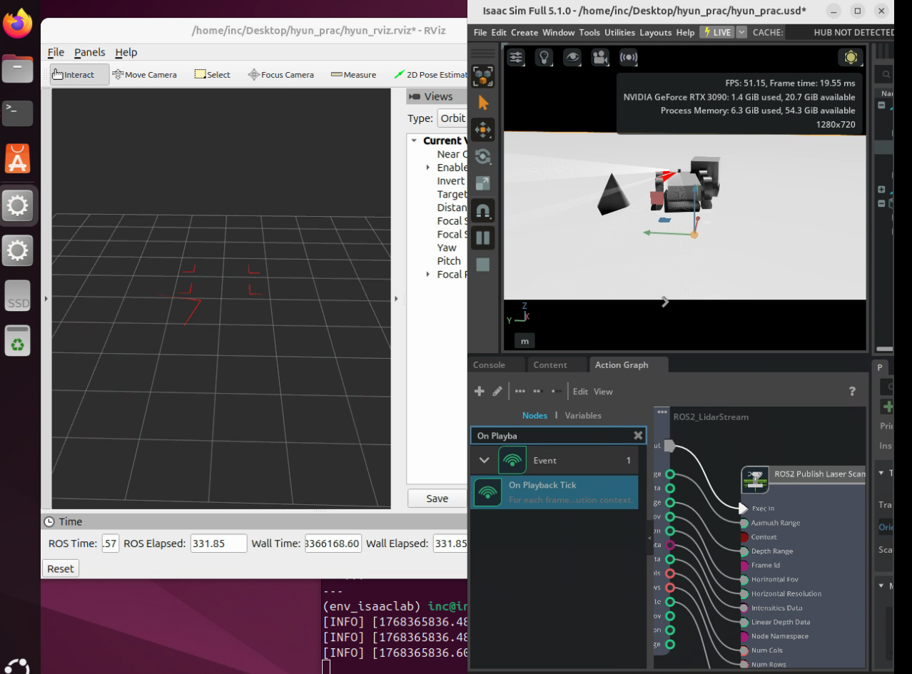
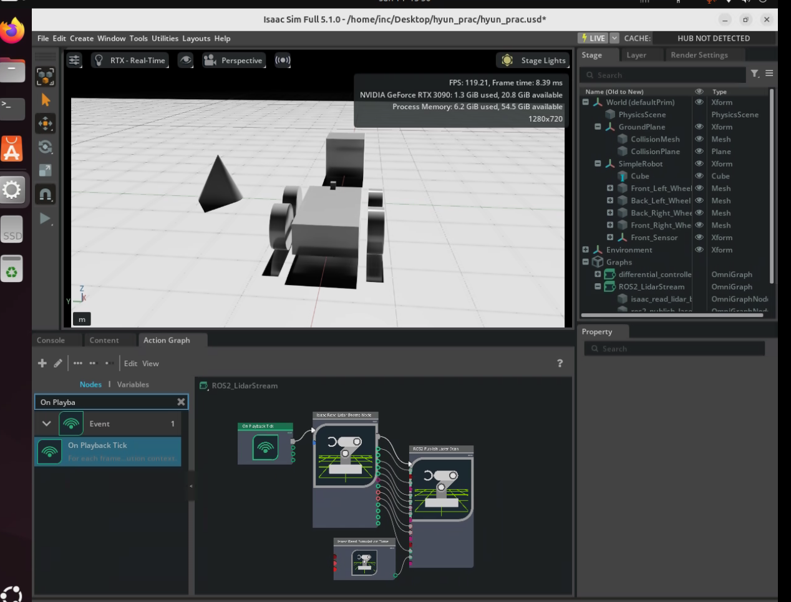

# 02. Isaac Sim — Chapter 01: Building Your First Robot in Isaac Sim

This chapter documents my first end-to-end robotics workflow in NVIDIA Isaac Sim.
Starting from a simple robot model, I progressed through physics setup, control with OmniGraph, sensor integration, and finally streaming LiDAR data to ROS 2 and visualizing it in RViz.

---

## What I Built (Pipeline)

- Robot Modeling
  - Built `SimpleRobot` with a chassis (cube) and 4 wheels (cylinders)
  - Structured the robot using USD hierarchy (Xform parent-child)

- Physics Configuration
  - Added Physics Scene (gravity / simulation context)
  - Enabled Rigid Body + Colliders
  - Added Ground Plane for stable physical interaction

- Control
  - Implemented a differential controller using OmniGraph
  - Enabled keyboard input for manual driving

- Sensors
  - Added an RGB Camera for visual perception
  - Added a 2D PhysX LiDAR and enabled debug visualization

- ROS 2 Integration
  - Enabled ROS 2 Bridge
  - Built an ActionGraph (`ROS2_LidarStream`) to publish `LaserScan`
  - Verified streaming and visualization in RViz

---

## Key Takeaways

### 1) Visual Mesh ≠ Physical Object
A visible mesh does not automatically interact with physics.  
To enable realistic simulation, objects must be configured with:
- Physics Scene
- Rigid Body
- Collider / Collision Mesh

### 2) Hierarchy (Xform) is essential for robot structure
Managing the robot with a parent `Xform` makes it easier to:
- move the robot as a group,
- keep transforms consistent,
- and extend the system (e.g., sensor mounts and frames).

### 3) Differential control connects commands to wheel motion
The differential controller converts:
- linear velocity + angular velocity  
into wheel motion for navigation.

### 4) PhysX LiDAR requires physical properties on obstacles
PhysX-based LiDAR often needs obstacles to have colliders/physics enabled,
otherwise it may fail to detect them.

### 5) ROS 2 streaming depends on Topic/Frame alignment
For RViz visualization to work correctly, TopicName and FrameID
must match the configuration used in Isaac Sim ActionGraph and RViz.

---

## Results (Screenshots)

### RViz: LiDAR LaserScan Visualization

### Isaac Sim: ActionGraph (ROS2_LidarStream)

### Isaac Sim: Scene + Stage/Graphs

---

## Conclusion
This chapter completed a full simulation → control → sensing → ROS 2 streaming workflow.
It provides a solid foundation for the next Isaac Sim modules, such as importing robot assets
and building more realistic simulation pipelines.