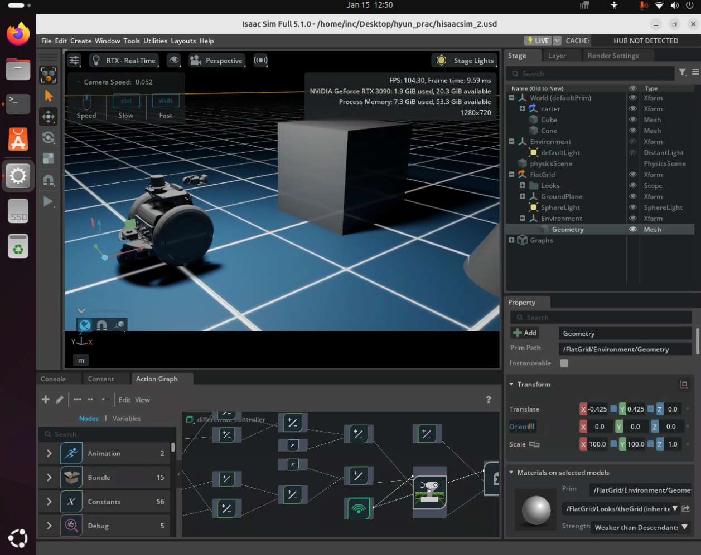
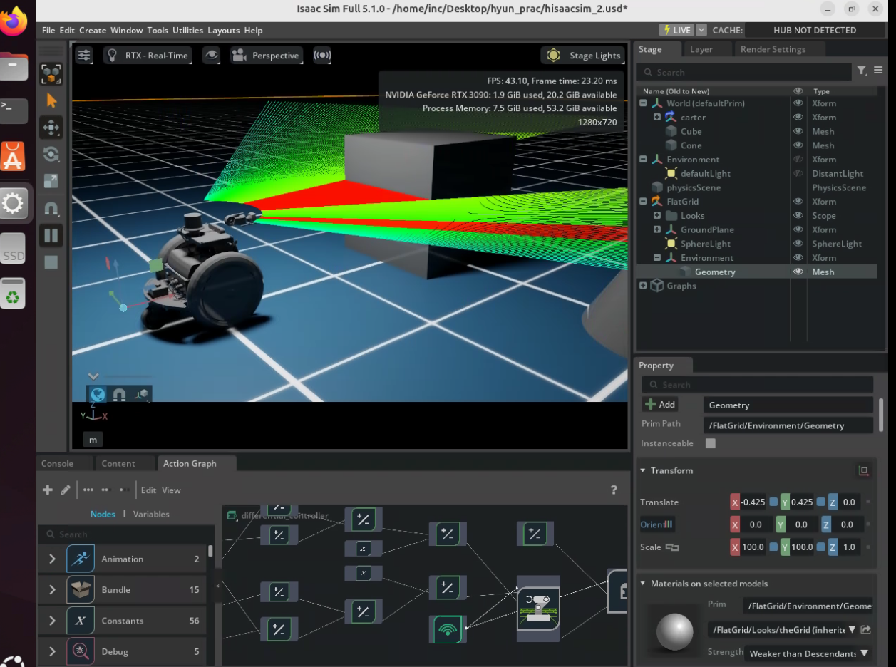
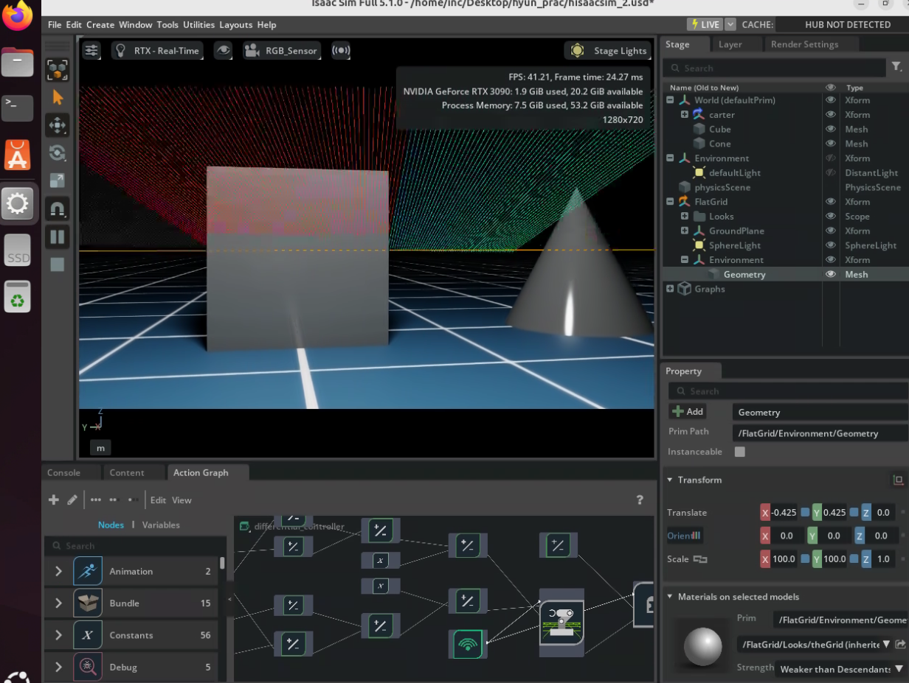
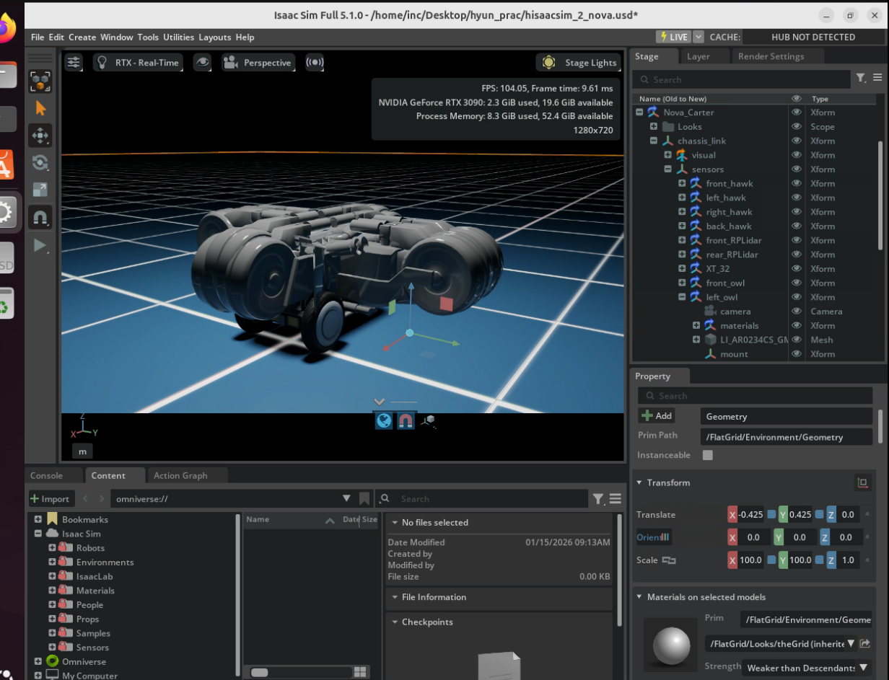

# 02. Isaac Sim — Chapter 02: Ingesting Robot Assets and Simulating Your Robot in Isaac Sim

This chapter documents my workflow for importing a real robot asset (URDF), preparing a simulation stage, adding perception sensors, and exploring a fully preconfigured robot asset (Nova Carter) in NVIDIA Isaac Sim.
I started with the URDF-based Carter robot, validated physics and articulation behavior, implemented differential drive control, mounted an RGB camera and PhysX LiDAR, and finally compared it with Nova Carter, which comes ready-to-use with an advanced sensor suite.

---

## What I Built (Pipeline)

- URDF Asset Import (URDF → USD)
  - Reviewed URDF structure (`link`, `joint`, `visual/collision/inertial`)
  - Imported `carter.urdf` using Isaac Sim URDF Importer
  - Configured key import settings:
    - Fix Base Link OFF (mobile robot)
    - Joint Target Type:
      - `left_wheel`, `right_wheel` → Velocity
      - `rear_pivot`, `rear_axle` → None (passive)

- Simulation Preparation + Validation
  - Built a minimal stage for testing:
    - FlatGrid ground
    - Adjusted robot pose so it sits above the ground
  - Verified physics behavior (gravity + collisions) by running the simulation
  - Managed collider visualization for cleaner debugging

- Robot Motion + Differential Control
  - Inspected Carter’s joints and roles:
    - Drive wheels rotate about Y-axis
    - Rear caster pivots passively (Z-axis pivot + Y-axis rolling)
  - Tested motion by setting wheel target velocities and observing forward/turning behavior
  - Added a prebuilt Differential Controller (OmniGraph) with keyboard driving (W/A/S/D)
  - Tuned speed limits for stable, realistic control:
    - `maxLinearSpeed`, `maxAngularSpeed` adjusted to reasonable values (e.g., 0.5)

- Sensor Integration + Interaction Testing
  - Mounted sensors directly in Isaac Sim (URDF does not define sensors here):
    - RGB camera attached under `Carter > chassis_link`
    - Rotating 2D PhysX LiDAR attached under `Carter > chassis_link`
  - Validated sensors via visualization:
    - Camera viewport preview (sensor view)
    - LiDAR beam lines (gray = no hit, red = hit)
  - Added obstacles and converted them into physical objects (Rigid Body + Colliders)
    - Confirmed LiDAR only detects objects with colliders/physics enabled

- Accessing a Prepared Robot Asset (Nova Carter)
  - Started a fresh stage and imported Nova Carter (built-in asset)
  - Inspected structure + sensor suite:
    - Stereo cameras, 2D LiDAR, 3D LiDAR, IMU (preconfigured)
  - Compared manual Carter setup vs ready-to-use Nova Carter
  - Positioned Nova Carter as a strong base for advanced workflows (e.g., SDG)

---

## Key Takeaways

### 1) URDF is the robot’s blueprint — but Isaac Sim runs on USD
URDF describes a robot’s physical structure (links/joints/physics), but Isaac Sim uses OpenUSD.
The URDF Importer bridges this gap by converting URDF assets into a simulation-ready USD robot.

### 2) Environment setup is the first validation step
A simple FlatGrid ground is enough to validate gravity, colliders, and stable contact behavior before building complex scenes.

### 3) Active vs Passive joints matter for realistic motion
Carter’s drive wheels should be velocity-driven, while the caster system should remain passive.
Correct target types prevent unnatural constraints and improve stability.

### 4) Differential drive control requires correct geometry + reasonable speed limits
Wheel radius and wheel distance must match the robot’s geometry for accurate motion.
Speed limits (linear/angular) are essential to avoid unrealistic commands and unstable movement.

### 5) Sensors must be attached to the robot hierarchy and need physics-aware environments
Sensors must be parented under the robot (`chassis_link`) to move correctly.
PhysX LiDAR relies on colliders—visible meshes without physics won’t be detected.

### 6) Prebuilt robot assets accelerate advanced robotics workflows
Nova Carter is fully configured (materials/physics/sensors), allowing immediate focus on navigation, perception, and SDG-style data generation tasks.

---

## Results (Screenshots)

### Carter: Stage + Environment (FlatGrid + Obstacles)

### Carter: LiDAR Beam Visualization (Hit vs No-Hit)

### Carter: RGB Sensor View

### Nova Carter: Preconfigured Robot + Sensor Hierarchy

---

## Conclusion
This chapter completed an end-to-end “asset-based” simulation workflow in Isaac Sim:
URDF import → physics validation → differential control → sensor integration → obstacle interaction testing.
Finally, by exploring Nova Carter, I confirmed how prebuilt robot assets can skip setup overhead and enable faster iteration toward advanced robotics tasks such as perception pipelines and Synthetic Data Generation (SDG).